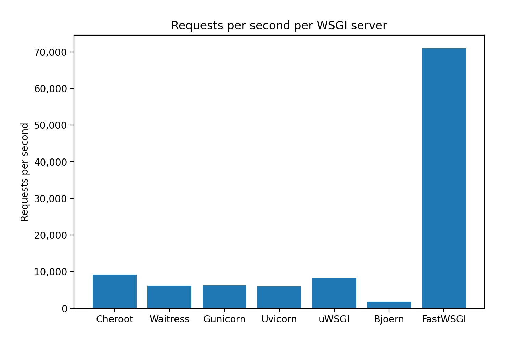
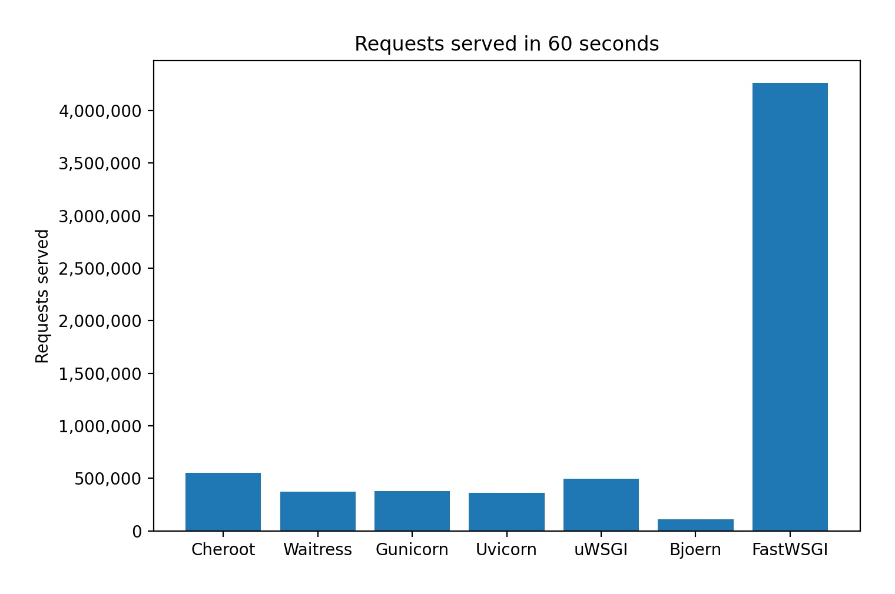
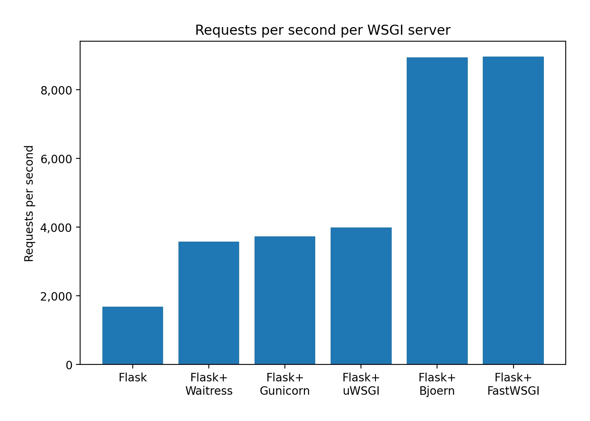
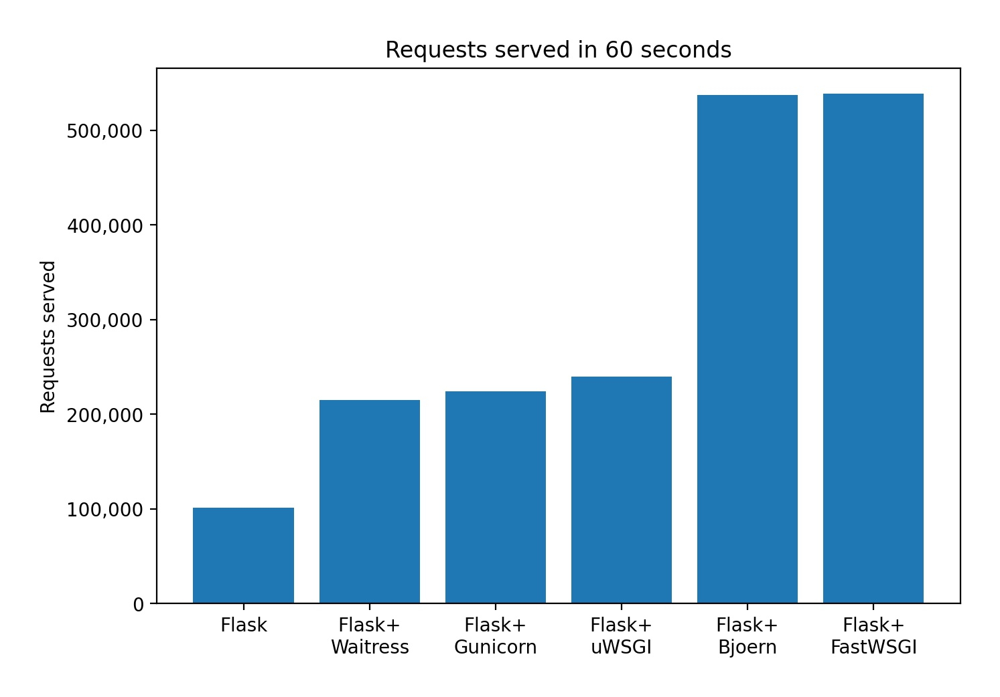

# Performance Benchmarks

A set of "Hello World" benchmarks comparing FastWSGI's performance to other popular WSGI servers.

All benchmarks were performed with [wrk](https://github.com/wg/wrk) on Ubuntu 20.04 with an Intel i9 9900k CPU.

- 8 threads
- 100 concurrent connections
- 60 second load duration

All servers were set up to use just a single worker (1 process). To see each server implementation, see the [servers](./servers) folder.

```bash
wrk -t8 -c100 -d60 http://localhost:5000 --latency
```

To see detailed results for each WSGI server, see the [results](./results) folder.

If you would like to reproduce these benchmarks on your own system you can clone this repo and run:

Note: You will need to have [wrk](https://github.com/wg/wrk) installed in order to run the benchmarks yourself.

```
cd performance_benchmarks/
./benchmark_all.sh
```

## Simple WSGI application benchmarks

This group of benchmarks compares how a simple "Hello World" WSGI application performs with varying underlying WSGI servers.

```python
import fastwsgi

def application(environ, start_response):
    headers = [('Content-Type', 'text/plain')]
    start_response('200 OK', headers)
    return [b'Hello, World!']

if __name__ == '__main__':
    fastwsgi.run(wsgi_app=application, host='127.0.0.1', port=5000)
```

For a simple WSGI application, if you're looking for speed, FastWSGI is simply unmatched! 

On a **single worker**, over 70k requests per second and over 4 million requests served in 60 seconds!

### Requests per second




### Requests served in 60 seconds



## Simple Flask application benchmarks

This group of benchmarks compares how a simple "Hello World" Flask application performs with varying underlying WSGI servers. 

```python
import fastwsgi
from flask import Flask

app = Flask(__name__)


@app.get('/')
def hello_world():
    return 'Hello, World!', 200


if __name__ == '__main__':
    fastwsgi.run(wsgi_app=app, host='127.0.0.1', port=5000)
```

FastWSGI performs on par with [bjoern](https://github.com/jonashaag/bjoern), another ultra fast WSGI server written in C. It appears that Flask is the likely bottleneck here and not the WSGI server being used. Pushing a simple Flask application significantly beyond 9k Requests per second on a single worker seems unlikely.


### Requests per second




### Requests served in 60 seconds


